# **BusTripManagement**

**BusTripManagement** is a real-time bus tracking and route management system.


# **Features**
* Live bus movement tracking (real-time)
* Route selection UI (Flutter)
* Stop-based alerts (when bus approaches a stop)
* SignalR group switching per route
* KML route extraction and storage
* API-driven location update + route mapping
* Location provider & simulator for testing
* Multi-layer .NET architecture (API → BAL → DAL → DB)
<br/>**(Live Vacant seat monitoring to be added soon)**

# **Interface Overview**


---

# **Tech Stack & Architecture**

<table>
<tr>
<td width="260" valign="top">

### **Tech Stack**

<table>

<!-- FLUTTER APP -->

<tr>
<td align="center">
<b style="font-size:16px;">FLUTTER APP</b><br/><br/>
<code style="font-size:15px;">Flutter • Dart</code><br/><br/>
<strong> Route UI • SignalR Client</strong><br/>
</td>
</tr>

<tr><td align="center"><strong>↓ REST + SignalR</strong></td></tr>

<!-- API -->

<tr>
<td align="center">
<b style="font-size:16px;">BusTripManagement.API</b><br/><br/>
<code style="font-size:15px;">ASP.NET Core Web API</code><br/><br/>
<strong>Route APIs • SignalR Hub</strong><br/>
<strong>Location Broadcasting • Stop Notifications</strong>
</td>
</tr>

<tr><td align="center"><strong>↓</strong></td></tr>

<!-- BAL -->

<tr>
<td align="center">
<b style="font-size:16px;">BUSINESS LOGIC (BAL)</b><br/><br/>
<code style="font-size:15px;">C# Services</code><br/><br/>
<strong>Route Matching • Distance Logic</strong><br/>
<strong>Stop Reach Detection</strong>
</td>
</tr>

<tr><td align="center"><strong>↓</strong></td></tr>

<!-- DAL -->

<tr>
<td align="center">
<b style="font-size:16px;">DATA ACCESS (DAL)</b><br/><br/>
<code style="font-size:15px;">C# Repository Layer</code><br/><br/>
</td>
</tr>

<tr><td align="center"><strong>↓</strong></td></tr>

<!-- DB -->

<tr>
<td align="center">
<b style="font-size:16px;">DATABASE</b><br/><br/>
<code style="font-size:15px;">Azure SQL Server</code><br/><br/>
</td>
</tr>

</table>

</td>

<td width="1000" valign="center" align="center">

### **Visual Flow**

```mermaid
flowchart TD
    %% Nodes
    F[📱 Flutter App<br/>Route UI + Map + Background Location]
    API[🌐 BusTripManagement.API<br/>ASP.NET Core]
    BAL[🧠 Business Logic<br/>Distance + Stop Detection]
    DAL[🗂 Data Access Layer]
    DB[(🗄 Azure SQL Server)]
    HUB[🔔 Azure SignalR Hub<br/>Real-time Bus Updates]

    %% Connections
    F -->|REST API| API
    API --> BAL
    BAL --> DAL
    DAL --> DB

    F <-->|Real-time<br/>SignalR| HUB
    API --> HUB

    %% Styles
    style F fill:#E8F1FA,stroke:#1E70C1,stroke-width:2px,color:#0B2E4E
    style API fill:#E0F7F4,stroke:#00897B,stroke-width:2px,color:#004D40
    style BAL fill:#FFF5E6,stroke:#D4A017,stroke-width:2px,color:#6A5200
    style DAL fill:#F1E7FF,stroke:#7E57C2,stroke-width:2px,color:#3E2A7C
    style DB fill:#FFE9EC,stroke:#D64550,stroke-width:2px,color:#7A1F24
    style HUB fill:#FCE4EC,stroke:#C2185B,stroke-width:2px,color:#880E4F

```



</td>
</tr>
</table>

---
# **System Modules**

<table>

<tr><td colspan="2"><strong>ROUTES MODULE</strong></td></tr>
<tr>
  <td width="40%">
    • User selects from a catalog of routes<br>
    • App connects to SignalR "route group"<br>
  </td>
  <td width="60%"></td>
</tr>

<tr><td colspan="2"><strong>REAL-TIME TRACKING MODULE</strong></td></tr>
<tr>
  <td width="40%">
    • Displays bus movement on map<br>
    • Updates location from SignalR<br>
    • Detects distance from stops<br>
    • Alerts users when bus nears their stop  
  </td>
  <td width="60%"></td>
</tr>

<tr><td colspan="2"><strong>LOCATION PROVIDER MODULE</strong></td></tr>
<tr>
  <td width="40%">
    • Simulates real bus movement<br>
    • Sends location updates to API<br>
    • Useful for testing without GPS hardware  
  </td>
  <td width="60%"></td>
</tr>

</table>

# **Installation**

## **1. Clone the Repository**

```bash
git clone https://github.com/Kathirvelan213/BusTripManagement.git
cd BusTripManagement
```

---

# **Backend Setup (ASP.NET Core API)**

1. Open **BusTripManagement.sln**
2. Run SQL scripts inside **sqlCommands/**
3. Update connection string in `appsettings.json`
4. Restore NuGet packages
5. Run the API project

---

# **Flutter App Setup**

```bash
cd flutter_app
flutter pub get
flutter run
```

---

# **Location Provider Simulator (Optional)**

If using the *location-provider* repo:

```bash
git clone https://github.com/Kathirvelan213/location-provider
cd location-provider/location_provider_flutter
flutter run
```

Use this to simulate bus movement for testing.


